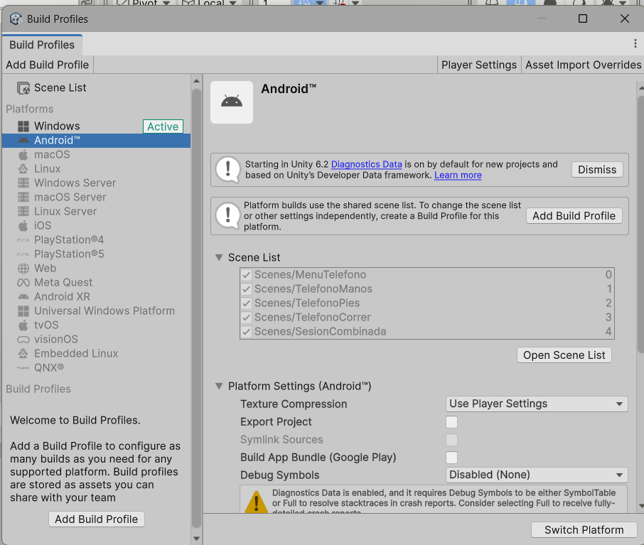
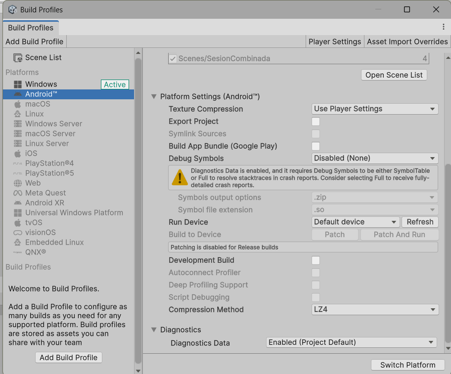
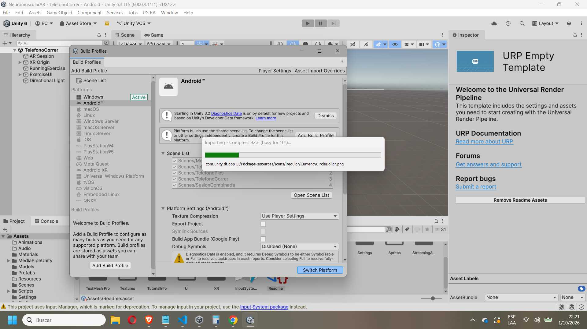
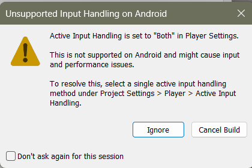
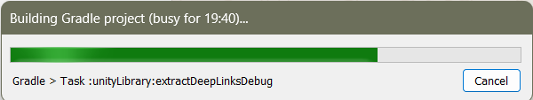
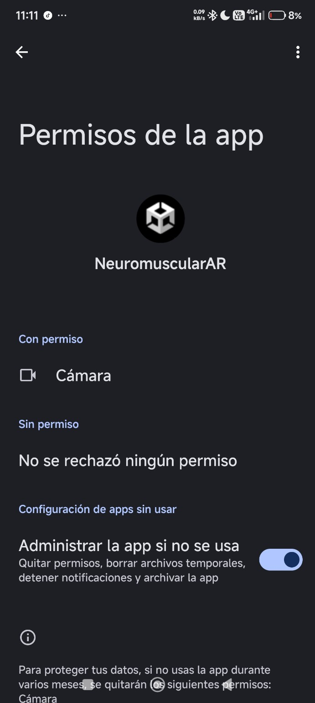
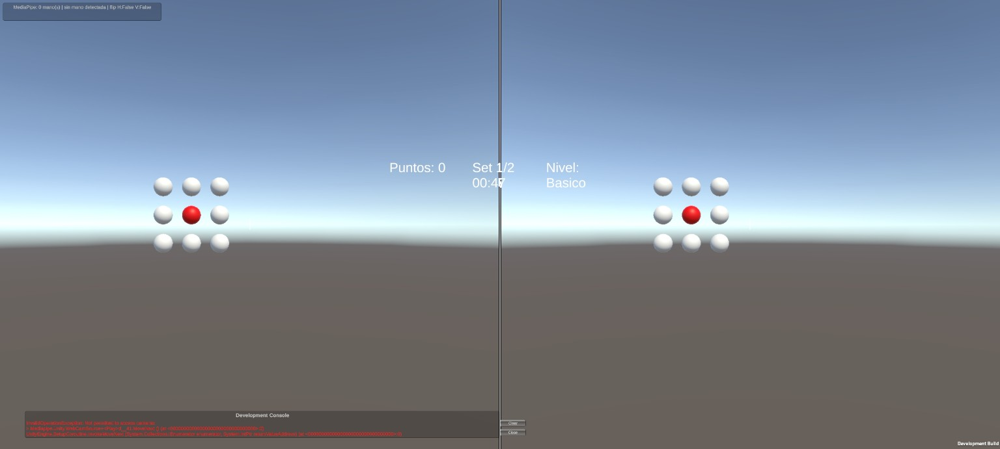
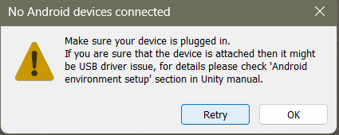

# Primera version estereoscopica para telefono

## Objetivo

La primera version dividio la pantalla del telefono en dos vistas: ojo izquierdo
y ojo derecho. Las dos camaras conservaron la configuracion de la camara
principal y se separaron 0.064 m para producir profundidad estereoscopica dentro
del visor.

## Preparación de dependencias

Antes de abrir Unity en una computadora nueva, ejecutar `py Tools/prepare_dependencies.py`
 desde la raíz del proyecto (en Linux/macOS: `python3`). El script reutiliza el paquete
 oficial 0.16.3 de Downloads o lo descarga y verifica su SHA-256. Unity usa una ruta
 relativa en `ThirdParty`; ya no depende de una carpeta personal de Windows.
 Véase [preparación de MediaPipe](../ThirdParty/README.md).

## Configuracion automatica

1. Seleccionar `PG RA > Crear todas las escenas para telefono`.
2. Abrir la escena generada `Assets/Scenes/MenuTelefono.unity`.
3. Ejecutar la escena y seleccionar un ejercicio individual o la sesion combinada.
4. Autorizar el uso de la camara cuando el sistema lo solicite.
5. Comprobar que aparezcan dos vistas y una cruz de alineacion en cada mitad.

El generador creo las escenas `TelefonoManos`, `TelefonoPies`,
`TelefonoCorrer`, `SesionCombinada` y `MenuTelefono`. Tambien las agrego a los
perfiles de compilacion en el orden requerido por el menu.

El componente `PhoneStereoRig` creo las camaras `PhoneStereoLeftEye` y
`PhoneStereoRightEye` durante la ejecucion. La camara original permanecio como
referencia para los otros componentes, pero dejo de renderizar directamente.

La escena integrada incorporo el ejecutor `HandLandmarkerRunner` de MediaPipe,
oculto la interfaz de demostracion del paquete y reutilizo la textura de la
camara como fondo. `HandTrackingBridge` recibio los landmarks del modelo y
`MediaPipeHandInteraction` convirtio la punta del dedo indice en rayos de
interaccion con los objetivos.

`TelefonoPies` utilizo una fuente de camara independiente, el modelo ONNX
mediante Sentis y tres zonas de contacto. `TelefonoCorrer` preparo AR Foundation
y ARCore para utilizar la posicion del telefono como referencia espacial dentro
del area calibrada.

## Sesion combinada

La escena `SesionCombinada` presento tres parametros antes de iniciar:

- cantidad de repeticiones del ciclo completo;
- segundos asignados individualmente a manos, pies y correr;
- segundos de descanso entre ejercicios.

Cada repeticion ejecuto, en orden, manos, pies y correr. Al finalizar el tiempo
de un ejercicio se invoco `StopExercise`, se mostro el descanso y se cargo la
siguiente escena. Los controladores individuales se iniciaron automaticamente
cuando la escena se ejecuto fuera de la sesion combinada.

## Parametros

- `Interpupillary Distance`: separacion entre los ojos. El valor inicial fue
  0.064 m.
- `Center Gap`: espacio central entre ambas vistas.
- `Use Toe In`: giro opcional de las camaras hacia un punto de convergencia.
  Se dejo desactivado para utilizar camaras paralelas.
- `Convergence Distance`: distancia usada solamente cuando `Use Toe In` esta
  activo.
- `Show Alignment Guide`: muestra la division central y dos cruces para revisar
  la alineacion antes de colocar el telefono en el visor.

## Generar e instalar una compilacion Android

### Estado de la captura recibida

En la ventana `Build Profiles`, Android ya esta seleccionado en la lista de
plataformas, pero Windows todavia figura como `Active`. Las cinco escenas estan
marcadas y ordenadas correctamente. En ese estado, el boton que corresponde es
`Switch Platform`, abajo a la derecha. Este paso cambia la plataforma activa;
todavia no genera el APK.

La captura complementaria muestra las opciones inferiores del perfil Android.
`Build App Bundle (Google Play)` aparece desmarcado, que es el ajuste para
producir un APK, y `Development Build` tambien aparece desactivado.

### Compilar el APK

1. En `File > Build Profiles`, seleccionar `Android` en la columna izquierda.
2. Verificar en `Scene List` que esten habilitadas y en este orden:
   `MenuTelefono`, `TelefonoManos`, `TelefonoPies`, `TelefonoCorrer` y
   `SesionCombinada`. `MenuTelefono` debe quedar primero porque es la pantalla
   de entrada de la aplicacion.
3. Si el boton inferior dice `Switch Platform`, pulsarlo y esperar a que Unity
   termine de cambiar de plataforma e importar los recursos. No cerrar Unity
   durante el proceso. Cuando Android quede activo, la interfaz ofrecera las
   opciones de compilacion.

   Durante este paso puede aparecer una ventana de importacion o compresion.
   La captura disponible muestra el proceso en curso, no una compilacion
   terminada; se debe esperar a que desaparezca.

   
4. Para crear un archivo instalable, dejar desmarcado `Build App Bundle (Google
   Play)`. Con esa opcion desmarcada, Unity genera un APK; marcada, genera un
   AAB destinado principalmente a Google Play.
5. Antes de compilar, abrir `Edit > Project Settings > Player > Other Settings
   > Configuration` y comprobar `Active Input Handling`. Debe estar en
   `Input System Package (New)`, no en `Both`. El rig estereoscopico y la
   calibracion de carrera usan Input System. La configuración guardada conserva
   `Both` por compatibilidad con otros scripts antiguos; la calibración táctil y
   por ratón funciona también al seleccionar únicamente el paquete nuevo. Si Unity pide
   reiniciar el Editor al cambiar la opcion, aceptar el reinicio y volver a
   `Build Profiles`.
6. Si aparece la advertencia de la captura siguiente, elegir `Cancel Build`,
   cambiar `Active Input Handling` a `Input System Package (New)`, reiniciar el
   Editor si lo solicita y volver a compilar. `Ignore` deja la configuracion
   `Both` y puede causar problemas de entrada o rendimiento en Android.

   

7. Para la primera prueba, activar `Development Build` si se necesitan logs y
   diagnostico. La captura muestra esta opcion desactivada. `Diagnostics Data`
   aparece habilitado y Unity advierte que para resolver stack traces se deben
   habilitar simbolos; es una advertencia de diagnostico, no el boton para
   cambiar de plataforma.
8. Pulsar `Build` (o `Build And Run` si el telefono Android esta conectado por
   USB, tiene depuracion USB autorizada y se quiere instalarlo automaticamente).
   Elegir una carpeta de salida y un nombre como `PGEntrenamiento-debug.apk`.
   Con `Build`, Unity guarda el APK en esa carpeta; no lo instala por si solo.

   Si `Build And Run` no vuelve a mostrar el selector de nombre y carpeta,
   Unity puede estar reutilizando una ruta de salida guardada. La captura
   siguiente muestra el paso `Building Gradle project` (`extractDeepLinksDebug`):
   la compilacion sigue en curso y aun no confirma que se haya generado el APK.
   Esperar a que Unity termine y comprobar el archivo en la ruta de salida.

   
9. Instalar el APK en el telefono. Se puede copiar el archivo al dispositivo y
   abrirlo desde alli, o usar `Build And Run` con el dispositivo conectado.
   Android puede pedir permiso para instalar aplicaciones desde esa fuente.
10. Abrir la aplicacion y aceptar el permiso de camara cuando Android lo solicite.
   Sin ese permiso, los ejercicios que usan MediaPipe, deteccion de pies o
   calibracion de carrera no pueden obtener la imagen de la camara.

### MediaPipe indica que no puede acceder a la cámara aunque Android la concedió

En la prueba se comprobó en Ajustes de Android que `NeuromuscularAR` tenía el
permiso de cámara concedido, pero la consola de Unity mostró
`InvalidOperationException: Not permitted to access cameras` desde
`WebCamSource.Play`. Las capturas 12 y 13 registran ambas cosas.

La comprobación original del plugin esperaba solo 0.1 segundos después de pedir
el permiso. Como la respuesta de Android es asíncrona, el plugin podía conservar
el estado como denegado aunque el permiso ya estuviera concedido en Ajustes. Se
actualizó `WebCamSource` para volver a consultar el permiso del sistema, esperar
la respuesta (hasta 20 segundos) y registrar un error claro si sigue denegado;
además, evita lanzar la excepción genérica al iniciar la webcam. El cambio debe
validarse reconstruyendo e instalando el APK en el teléfono. Si reaparece, hay
que guardar el nuevo registro de Unity/Logcat: la captura existente demuestra
el fallo anterior, no confirma todavía el resultado de la corrección.

### Unity no detecta el telefono conectado

El mensaje `No Android devices connected` significa que Unity no encuentra un
dispositivo Android disponible mediante ADB. Que el telefono cargue por USB no
confirma que la depuracion ADB este conectada.

En un Xiaomi 13T con HyperOS/Android, revisar en este orden:

1. Pulsar `OK` en la ventana de Unity y desbloquear el telefono.
2. Conectarlo con un cable que permita transferencia de datos. En la
   notificacion USB del telefono, elegir `Transferencia de archivos / Android
   Auto`.
3. Activar las opciones de desarrollador: `Ajustes > Acerca del telefono` y
   tocar varias veces `Version de SO`/`Version de HyperOS`. Luego abrir
   `Ajustes > Ajustes adicionales > Opciones de desarrollador` y activar
   `Depuracion USB`.
4. Desconectar y volver a conectar el cable. Aceptar en el telefono el aviso
   `¿Permitir depuracion USB?` y la huella RSA de esta computadora. Mantener el
   telefono desbloqueado mientras se autoriza.
5. En `Build Profiles`, abrir `Run Device`, pulsar `Refresh` y seleccionar el
   Xiaomi cuando aparezca. Luego usar `Build And Run`.
6. Si sigue sin aparecer, probar otro cable de datos y otro puerto USB. En
   Windows, revisar el Administrador de dispositivos e instalar/actualizar el
   controlador ADB del fabricante si el dispositivo figura con error.
7. Para comprobar ADB directamente, abrir `Edit > Preferences > External
   Tools` en Unity y localizar `Android SDK`. Desde la carpeta
   `platform-tools`, ejecutar `adb devices -l` (en PowerShell puede ser
   `./adb.exe devices -l`). El estado `device` indica que ADB ya lo ve;
   `unauthorized` requiere aceptar el aviso en el telefono. Si la lista sale
   vacia, revisar cable, depuracion USB, puerto y controlador.

Como alternativa para generar el instalador sin que Unity instale la app,
seleccionar `Build` en lugar de `Build And Run`. Unity puede crear el APK sin
tener el telefono seleccionado; despues se copia el archivo al telefono y se
instala desde alli. La instalacion automatica con `Build And Run` requiere que
ADB detecte y autorice el dispositivo.

Referencias oficiales: [conectar un dispositivo Android mediante ADB](https://developer.android.com/studio/run/device), [activar opciones de desarrollador en Xiaomi](https://www.mi.com/global/support/faq/details/KA-168765/) y [activar depuracion USB en Xiaomi](https://www.mi.com/global/support/article/KA-06515/).

### Preparacion y prueba en el telefono

1. En `Project Settings > XR Plug-in Management > Android`, comprobar que
   `ARCore` esta habilitado si la prueba de carrera usa seguimiento espacial.
   Los paquetes de AR Foundation y ARCore estan incluidos en el proyecto.
2. Mantener la orientacion horizontal para la disposicion estereoscopica.
3. Al abrirse `MenuTelefono`, elegir manos, pies, correr o sesion combinada.
   En la sesion combinada se pueden configurar repeticiones del ciclo, tiempo
   por ejercicio y descanso entre ejercicios.
4. Para correr, completar la calibracion del area antes de empezar. La zona
   debe quedar delimitada por el usuario desde la pantalla de calibracion.
5. Comprobar que el menú ocupe una sola pantalla horizontal para la selección
   táctil. Al iniciar un ejercicio, comprobar las dos vistas estereoscópicas, la
   guía de alineación y la imagen de la cámara. Probar por separado los ejercicios
   y luego la sesión combinada.
6. Ajustar `Interpupillary Distance` entre 0.058 y 0.070 m si la imagen se
   percibe doble o incomoda. Desactivar `Show Alignment Guide` despues de
   validar la posicion de ambas vistas.

### Menú horizontal de selección táctil

`MenuTelefono` es una pantalla de configuración para tocar directamente en el
teléfono antes de colocarlo en el visor. Por eso muestra una sola interfaz
horizontal a pantalla completa: no divide ni duplica el menú para las lentes.
La interacción por MediaPipe no forma parte del menú; las manos se detectan y
usan dentro del ejercicio correspondiente.

`PhoneExerciseMenu` fija la orientación en horizontal, centra un panel único y
adapta su anchura al teléfono. Desde allí se elige un ejercicio o el circuito y
se configuran dificultad, duración, repeticiones y descanso. La compilación debe
reconstruirse para comprobar la orientación y la entrada táctil en el dispositivo.

### Ajustes identificados antes de distribuir la app

La configuracion guardada del proyecto tiene `AndroidMinSdkVersion: 25`, usa
ARM64 y conserva el identificador de paquete de la plantilla de Unity
(`com.UnityTechnologies.com.unity.template.urpblank`). Ese identificador sirve
para una prueba local, pero se debe reemplazar por uno propio antes de entregar
la aplicacion a otras personas o publicarla. El campo `cameraUsageDescription`
del proyecto esta vacio; conviene configurar una explicacion clara para el
permiso de camara antes de distribuirla.

El APK de prueba no requiere keystore de publicacion. Para publicar en Google
Play se debe configurar la identidad definitiva, version, firma/keystore y
generar un AAB de release. Esos pasos no forman parte de la compilacion local
de prueba descrita arriba.

### Captura: fondo de cámara magenta en la escena de manos

En la captura recibida, los objetivos y el HUD estereoscópico se dibujan, pero el
fondo detrás de ellos aparece magenta y el diagnóstico indica cero manos. El
magenta señala que Unity no pudo usar el shader del fondo de cámara. El código
previo buscaba un shader por nombre en tiempo de ejecución; Android puede
eliminar shaders que no estén referenciados por un recurso incluido.

Se añadió un shader URP propio y un material guardado dentro de `Resources`, y
`MediaPipeStereoBackground` carga ese material para que Unity incluya el shader
en el APK. La actualización de textura también asigna explícitamente `_BaseMap`,
la propiedad de textura del shader URP. Esto corrige la causa probable del fondo
magenta; falta compilar e instalar el APK nuevo para verificar que la cámara
aparezca en el teléfono y confirmar que MediaPipe detecte la mano. La captura
registra el estado anterior a esa verificación.

## Límite de esta primera versión

La división estereoscópica se aplica a las escenas de ejercicio. El menú es una
interfaz táctil horizontal de una sola vista, no un menú para utilizar dentro del
visor. Algunos indicadores configurados como `Screen Space Overlay` todavía
ocupan la pantalla completa; para presentarlos cómodamente en cada ojo queda
pendiente trasladarlos a objetos tridimensionales o duplicarlos mediante dos
Canvas configurados como `Screen Space Camera`.

## Correcciones de cámara y comprobación pendiente en Android

El fondo de manos y pies transforma las UV con la rotación y el espejo vertical
reportados por la fuente de cámara, además del espejo horizontal configurado.
El plano compartido se amplía para cubrir la separación entre los ojos y evitar
franjas negras exteriores. Se comprueba que el material y shader de Resources
estén disponibles. El plazo de espera de manos empieza a contar los frames
después de iniciar la cámara; el diálogo de permisos tiene un plazo separado.

Estas comprobaciones no reemplazan una prueba del APK. En el Xiaomi 13T:

1. Preparar MediaPipe, abrir Unity y reconstruir el APK desde esta rama.
2. Abrir manos y conceder el permiso: verificar video en ambos ojos, orientación
   y concordancia entre mano, landmarks y objetivos.
3. Abrir pies y comprobar los mismos puntos, especialmente al girar el teléfono
   entre LandscapeLeft y LandscapeRight. Probar izquierda azul y derecha roja.
4. Abrir correr, marcar cuatro esquinas y comprobar respuesta táctil.
5. Repetir entrando y saliendo de las escenas, y ejecutar la sesión combinada.
6. Si hay negro o magenta, guardar Logcat junto con escena, dispositivo y captura.

La revisión estática y las pruebas del preparador de dependencias no confirman
la captura, la ejecución del shader ni el rendimiento del modelo en el teléfono.

## Fondo negro en correr: renderer de ARCore

Los renderers Mobile y PC no incluían ARBackgroundRendererFeature. El editor
ahora agrega y activa esa feature al cargar el proyecto y antes de compilar;
también puede ejecutarse Tools > Phone Training > Repair AR Camera Background.
No hace falta regenerar las escenas. Los ojos usan ClearFlags.Nothing en URP
para conservar el color del video de la cámara base, en sus viewports separados.
En el pipeline integrado se conserva la limpieza de profundidad anterior.

Después de actualizar la rama, esperar la compilación de scripts, reconstruir
e instalar el APK. Verificar video en ambas mitades, delimitación del suelo y
objetivos después de entrar desde manos/pies y desde sesión combinada. Esta
corrección del renderizado no confirma que ARCore haya iniciado en el dispositivo.
Si sigue negro, recoger Logcat y estado de AR Session. No se usa una segunda
WebCamTexture en Android porque competiría con ARCore por la cámara.
